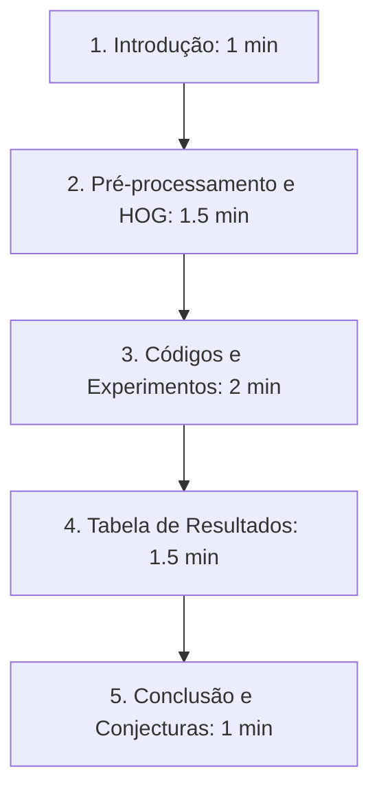

# Roteiro para o Vídeo de Apresentação do Projeto

**Tema:** Classificação de Tumores Cerebrais em Imagens de RM com IA  
**Estrutura Recomendada:** Gravação de tela (screencast) demonstrando os códigos e resultados.  
**Duração Alvo:** 5 a 8 minutos.  

---

## Estrutura do Vídeo

---

## Detalhamento das Cenas e Falas

### Cena 1: Introdução (Duração: ~1:00 min)
*   **O que mostrar na tela:** O arquivo [README.md](file:///d:/Projetos/brain-tumor-classification-ai-2026/README.md) aberto no editor ou a página inicial do notebook no Google Colab/VS Code mostrando o título do projeto.
*   **Ação:** Apresentar-se brevemente, falar o curso, campus e o tema do projeto prático.
*   **Fala Sugerida:**
    > "Olá, professor! Meu nome é Caíque Augusto, sou aluno do Bacharelado em Sistemas de Informação no IFMG, Campus Ouro Branco. Vou apresentar o desenvolvimento e os resultados do meu projeto prático da disciplina de Inteligência Artificial sobre a detecção de tumores cerebrais a partir de imagens de Ressonância Magnética.
    > 
    > O objetivo principal deste trabalho foi construir e avaliar classificadores capazes de categorizar imagens de RM em quatro classes: Glioma, Meningioma, Tumor Hipofisário e imagens sem tumor. O dataset possui 7.200 imagens no total, e dividimos isso de forma estratificada e balanceada para garantir que o conjunto de teste de 1.600 imagens tivesse exatamente 400 imagens de cada uma das quatro categorias."

---

### Cena 2: Pré-processamento e Extração de Características HOG (Duração: ~1:30 min)
*   **O que mostrar na tela:** O notebook no trecho da função `carregar_imagem_tf` e, logo em seguida, a função `extrair_hog_imagem`.
*   **Ação:** Explicar como as imagens foram tratadas de forma diferente para a CNN e para o SVM.
*   **Fala Sugerida:**
    > "Para resolver esse problema de classificação, eu trabalhei com duas abordagens muito distintas. A primeira foram as Redes Neurais Convolucionais (CNNs) usando Keras, onde as imagens foram redimensionadas para 128x128 pixels e normalizadas dividindo os valores dos pixels por 255.0 para trazê-los ao intervalo de zero a um.
    > 
    > A segunda abordagem foram os classificadores SVM da biblioteca Scikit-Learn. Como os SVMs não lidam bem com matrizes de imagem brutas devido à altíssima dimensionalidade, nós convertemos as imagens para escala de cinza, redimensionamos para 64x64 e aplicamos o extrator de características HOG (Histogram of Oriented Gradients). O HOG descreve orientações de bordas e texturas locais, reduzindo a complexidade de cada imagem para um vetor de apenas 1.764 características estruturais muito ricas, que depois foram padronizadas."

---

### Cena 3: Implementação dos Experimentos - CNN vs SVM (Duração: ~2:00 min)
*   **O que mostrar na tela:** O código de definição das redes neurais (Experimentos 1 a 4) e depois os Pipelines dos SVMs (Experimentos 5 a 8).
*   **Ação:** Passar rapidamente pelos experimentos no notebook, destacando as variações de parâmetros pedidas no enunciado.
*   **Fala Sugerida:**
    > "No total, realizei 8 experimentos sistemáticos. Nos primeiros 4 experimentos, variamos parâmetros das Redes Neurais Convolucionais:
    > - O Experimento 1 é a nossa CNN básica com três camadas convolucionais de 32, 64 e 128 filtros e sem regularização.
    > - No Experimento 2, inserimos uma taxa de Dropout de 20% após a camada densa.
    > - No Experimento 3, adicionamos camadas de Batch Normalization após as convoluções e elevamos o Dropout para 50%.
    > - E no Experimento 4, tentamos combater o overfitting usando Data Augmentation dinâmico, regularização L2 e Early Stopping com paciência de 4 épocas.
    > 
    > Nos experimentos de 5 a 8, aplicamos SVMs nas características HOG:
    > - O Experimento 5 utilizou um kernel linear clássico com C=1.
    > - O Experimento 6 utilizou kernel RBF com C=1.
    > - O Experimento 7 aumentou a penalização de erro do kernel RBF usando C=10.
    > - E o Experimento 8 aplicou uma redução de dimensionalidade adicional com PCA para extrair as 256 principais componentes das características HOG, além de ativar pesos de classe balanceados para testar o comportamento."

---

### Cena 4: Tabela Comparativa de Resultados (Duração: ~1:30 min)
*   **O que mostrar na tela:** O arquivo [resultados_8_experimentos.csv](file:///d:/Projetos/brain-tumor-classification-ai-2026/resultados/resultados_8_experimentos.csv) formatado (ou a tabela renderizada do relatório) e algumas matrizes de confusão abertas, como a do Experimento 7.
*   **Ação:** Apontar para os números na tabela, comparando diretamente o desempenho da CNN com o do SVM.
*   **Fala Sugerida:**
    > "Aqui podemos ver a tabela de resultados finais consolidada. O grande destaque foi o **Experimento 7: SVM com kernel RBF e C=10**, que obteve a melhor performance geral com uma acurácia de **89,44%** e um F1-Score macro de **89,10%** no conjunto de teste independente. O Experimento 8, que utilizou redução de dimensionalidade via PCA, obteve um resultado virtualmente idêntico (89,25% de acurácia), mas treinou em apenas **3,47 segundos**, o que representa uma economia computacional de mais de 70% comparado ao Experimento 7.
    > 
    > Por outro lado, as CNNs apresentaram resultados abaixo do esperado. A CNN básica atingiu 71,94% de acurácia. E a CNN do Experimento 4, altamente regularizada, sofreu subajuste severo, interrompendo o treinamento por Early Stopping na época 5 com apenas 32,44% de acurácia, apresentando 883 falsos negativos."

---

### Cena 5: Discussão, Conjecturas e Conclusão (Duração: ~1:00 min)
*   **O que mostrar na tela:** A matriz de confusão do Experimento 7 ([experimento_07.png](file:///d:/Projetos/brain-tumor-classification-ai-2026/resultados/matrizes_confusao/experimento_07.png)) e a conclusão do relatório.
*   **Ação:** Explicar conceitualmente os motivos físicos/matemáticos dessas diferenças e encerrar.
*   **Fala Sugerida:**
    > "Existem algumas razões claras para o SVM baseado em HOG ter superado as CNNs:
    > 1. As CNNs foram treinadas por apenas 15 épocas devido ao tempo e custos de computação. Para aprender características espaciais complexas do zero, as redes convolucionais necessitam de muito mais épocas. O HOG já fornece ao SVM contornos e formas de alta qualidade física, restando ao SVM apenas otimizar a fronteira de decisão.
    > 2. O vazamento de dados na divisão aleatória inflou o desempenho de validação da CNN (que chegou a mais de 83%), mas causou uma queda no teste, pois na saúde é comum termos fatias do mesmo paciente em ambos os conjuntos de treino e validação. O SVM RBF provou ser muito mais estável para generalizar em pacientes inéditos.
    > 3. O Experimento 3 da CNN teve apenas 26 falsos negativos, mas isso ocorreu por um colapso onde o modelo classificou quase tudo como meningioma, tornando-o inútil clinicamente.
    > 
    > Portanto, a melhor abordagem sob a ótica de desempenho foi o SVM RBF C=10, e a melhor abordagem sob a ótica de eficiência computacional foi o SVM RBF com PCA.
    > 
    > Essa foi a minha apresentação. Muito obrigado, professor!"

---

## Dicas para uma Ótima Gravação

> [!TIP]
> *   **Áudio claro:** Use um microfone adequado e grave em um ambiente silencioso.
> *   **Zoom no código:** Aumente a fonte do seu editor de código (VS Code/Google Colab) para que fique legível na gravação do vídeo.
> *   **Passear pelo mouse:** Use o cursor do mouse para guiar a atenção do professor para as linhas de código ou números da tabela de resultados de que você está falando.
